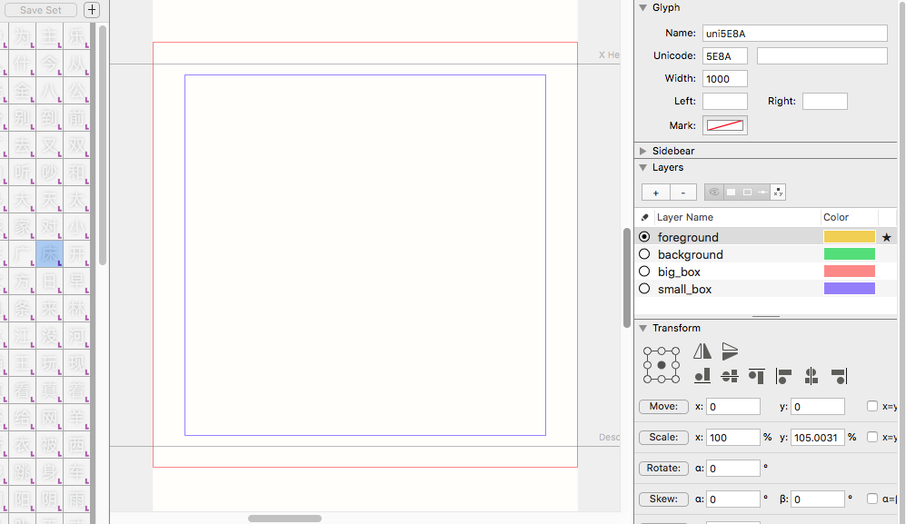

# Scripts for quickly setting up CJ ideographs in Robofont.
These simple scripts should each provide a basic setup in your UFO for working with Chinese Hanzi or Japanese Kanji, adding new glyphs, establishing box guides, changing vertical metrics, manipulating RF preferences. 

Thanks to TienMin Liao for the idea and help!
Reach out to one of us for questions or comments.

