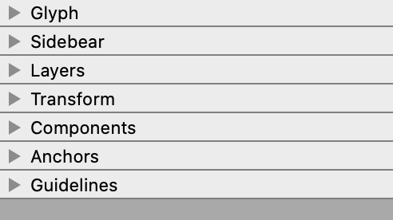

# Clear Inspector Panels
This allows you to hide panels you don't use in Inspector. 
 *"Out of sight, out of mind"*

This is a script currently meant to be implemented as a [start-up script](https://robofont.com/documentation/how-tos/setting-up-a-startup-script/?highlight=start-up). Prints out what it’s doing in the Output Dialog each time you open Inspector. If you don’t like that, you can comment out the `print()` statements.

