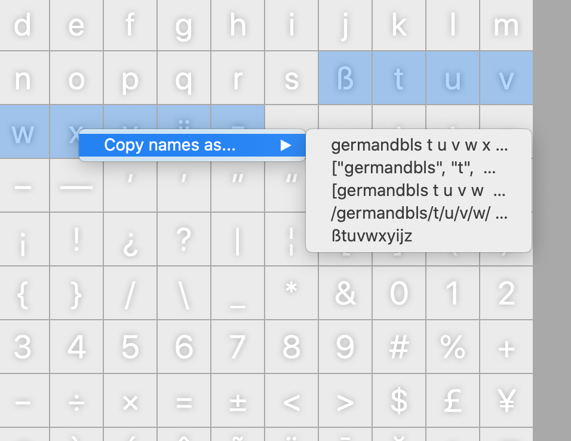

# Copy Names Menu	
A contextual menu for RoboFont’s Font Overview panel that enables you to copy the names of the selected glyphs to your clipboard in the format of your choosing. 

The code is basically [Erik van Blokland](http://letterror.com/)’s useful [`copyNamesToClipboard.py`](https://github.com/LettError/editThatNextMaster/blob/master/copyNamesToClipboard.py) combined with the Robofont’s generously provided [wrapper code](https://robofont.com/documentation/building-tools/toolspace/observers/custom-font-overview-contextual-menu/?highlight=menu) for building contextual menus.

This is a script currently meant to be implemented as a [start-up script](https://robofont.com/documentation/how-tos/setting-up-a-startup-script/?highlight=start-up).

