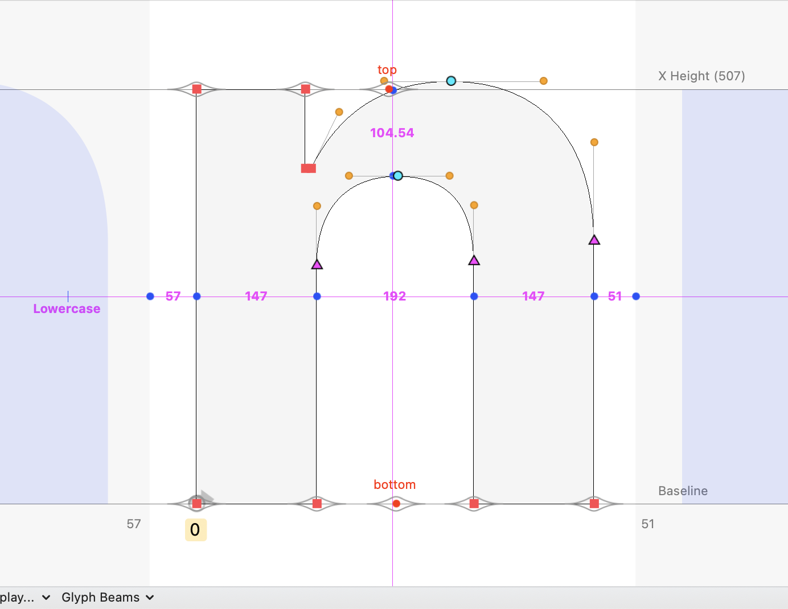

# Glyph Beam Menu

This gives you a drop-down menu in the Glyph Editor that enables you to toggle a “beam” (guide showing measurements) in the Glyph Editor at mid- x-height or cap-height.

The guide will...
* show measurements (on horizontal guides)
* be the color you chose for your Space Center beam.

This is a script currently meant to be implemented as a [start-up script](https://robofont.com/documentation/how-tos/setting-up-a-startup-script/?highlight=start-up). 

