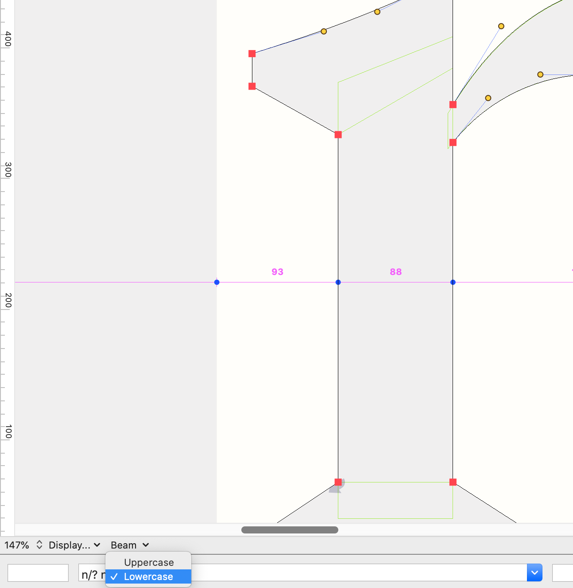

# Glyph Beam Menu
This gives you a drop-down menu in the Glyph View that enables you to toggle a "beam" (guide showing measurements) in the Glyph View at mid- x-height or cap-height.

The guide will... 
* show measurements.
* be the same color as your Space Center beam.
* return to its destined position when toggled.

This is a script currently meant to be implemented as a [start-up script](https://robofont.com/documentation/how-tos/setting-up-a-startup-script/?highlight=start-up). 

